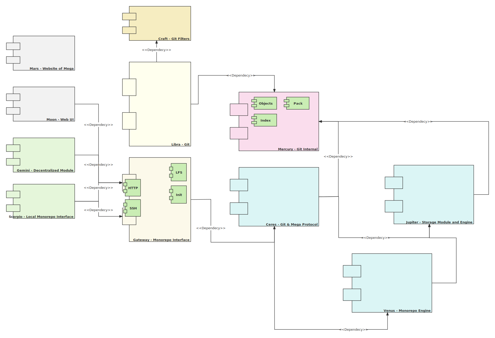

# Mega - is an unofficial open source implementation of Google Piper.

Mega is an unofficial open source implementation of Google Piper. It is a monorepo & monolithic codebase management system that supports Git. Mega is designed to manage large-scale codebases, streamline development, and foster collaboration.

## What's the Piper?

Google Piper is a massive, centralized version control system that Google uses internally to manage their vast codebase. It is a monorepo, and a monolithic which mean is a single repository that contains all the source code for Google's software. It is designed to manage large-scale codebases, streamline development, and foster collaboration. It is built on top of Google's internal infrastructure and is designed to be highly scalable and efficient. More information on the [Why Google Stores Billions of Lines of Code in a Single Repository](https://cacm.acm.org/magazines/2016/7/204032-why-google-stores-billions-of-lines-of-code-in-a-single-repository/fulltext).

:heavy_exclamation_mark: **Google Piper is not open source**

## Mega features

Mega is an unofficial open source implementation of Google Piper. And it has the following features:

### Git compatible

Mega offers the ability to utilize Git with a monorepo. This allows for easy cloning or pulling of any monorepo folder into local filesystem as a Git repository, and seamless pushing of changes back. 

### Trunk-based Development

When it comes to managing large codebases in a centralized manner, trunk-based development is the way to go. More trunk-based Development information on the [Trunk-Based Development](https://trunkbaseddevelopment.com/).

### Conventional Commits

Mega will  supports conventional commits, which are a set of rules for creating clear and concise commit messages.  More information on the [Conventional Commits](https://www.conventionalcommits.org/).

### Decentralized Open Source Collaboration

For now, the entire open source community base on Git and GitHub. It's centralized model and it's not suitable for growing speed of open source world. Mega is working on build a decentralized open source collaboration model with [ZTM](https://github.com/flomesh-io/ztm)(Zero Trust Model) and decentralized social network like [Nostr](https://nostr.com), [Matrix](https://matrix.org) and [Mastodon](https://joinmastodon.org).

## Quick Start

### Quick Try

For now, we are developing on the macOS and Arch Linux. And quick start manuel in the [Quick start manuel to developing or testing](docs/development.md#quick-start-manuel-to-developing-or-testing).

### Quick Review of Architecture

1. **Gateway** - The Gateway module is responsible for handling `git`, `git-lfs` and web UI requests througth the HTTP and SSH protocol. More information on the [Gateway](gateway/README.md).
2. **Libra** - The Libra is a `git` program that rewrite in Rust. More information on the [Libra](libra/README.md).
3. **Craft** - The Craft is `git` filters inculde `git-lfs` and `encrypt`/`decrypt` filer. More information on the [Craft](craft/README.md).
4. **Gemini** - The Gemini is a decentralized module of Mega. More information on the [Gemini](gemini/README.md).
5. **Scorpio** - The Scorpio is a FUSE filesystem that allow you to mount a Mega repository as a local filesystem. More information on the [Scorpio](scorpio/README.md).
6. **Mercury** - The Mercury module is the core module of Mega, which rewrites Git internal object like Blob, Tree, etc. More information on the [Mercury Module](mercury/README.md).
7. **Ceres** - The Ceres impletement translate protocol for Mega. More information on the [Ceres](ceres/README.md).
8. **Jupiter** - The Jupiter is storage engine for Mega. More information on the [Jupiter](jupiter/README.md).
9. **Venus** - The Venus is a monorepo engine for Mega. More information on the [Venus](venus/README.md).
10. **Mars** - The Mars is website for Mega. More information on the [Mars](mars/README.md).
11. **Moon** - The Moon is a web UI for Mega. More information on the [Moon](moon/README.md).

## Contributing

The mega project relies on community contributions and aims to simplify getting started. To develop Mega, clone the repository, then install all dependencies and initialize the database schema, run the test suite and try it out locally. Pick an issue, make changes, and submit a pull request for community review.

More information on contributing to Mega is available in the [Contributing Guide](docs/contributing.md).

## Talk and Share

If you interested in Mega, you can make an appointment with us on [Google Calenader](https://calendar.app.google/QuBf2sdmf68wVYWL7) to disscuss your ideas, questions or problems and we will share our vision and roadmap with you.

## License

Mega is licensed under this Licensed:

- MIT LICENSE ( [LICENSE-MIT](LICENSE-MIT) or https://opensource.org/licenses/MIT)
- Apache License, Version 2.0 ([LICENSE-APACHE](LICENSE-APACHE) or https://www.apache.org/licenses/LICENSE-2.0)
